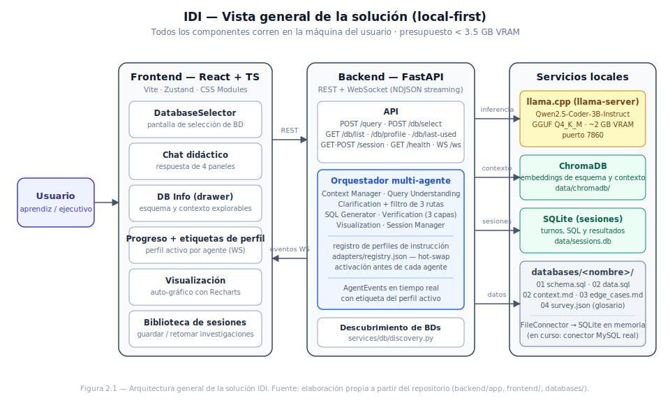
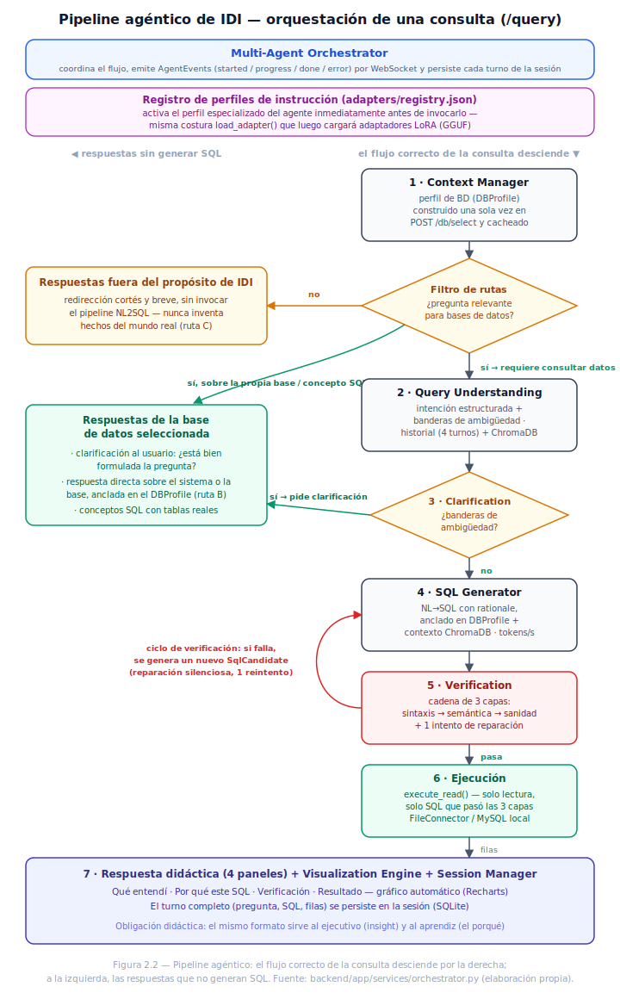
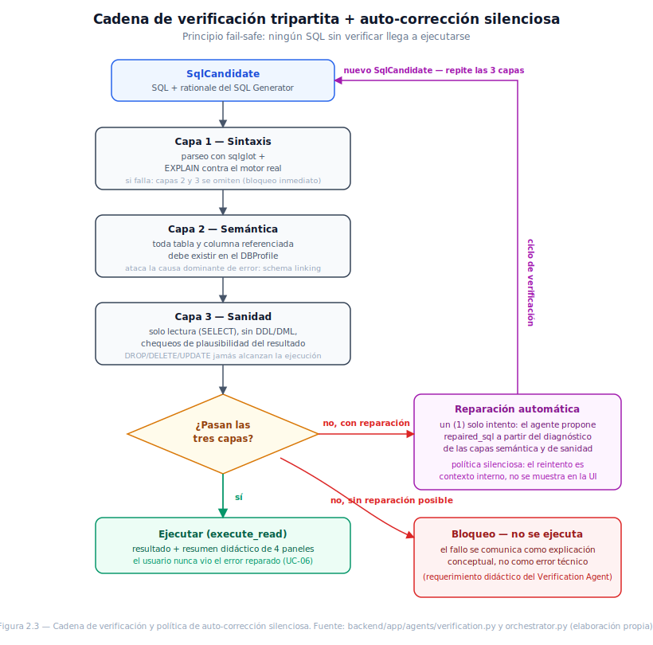
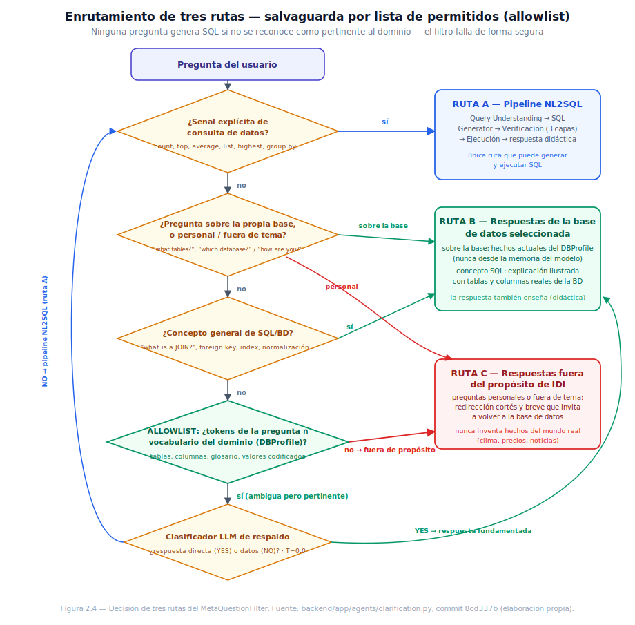

IDI — Interfaz Inteligente de Bases de Datos

Trabajo de Grado — Ingeniería de Sistemas y Computación
Universidad Nacional de Colombia
Autor: Juan David Ramírez Torres (jdramirezt@unal.edu.co)
Período: 2026-1S (Febrero 2 – Mayo 30, 2026)

> **[v3 — 2026-07-14]** Esta versión consolida el Capítulo 2 sobre la v2: incorpora los cuatro diagramas de diseño (solución general, pipeline agéntico, verificación tripartita y enrutamiento de tres rutas — `figures/fig_2_1` a `fig_2_4`), completa la especificación de contratos de API (§2.3), consolida la justificación del stack tecnológico (§2.8, FastAPI / ChromaDB / SQLite), añade un sondeo temprano de precisión ejecutado sobre el sistema real (§2.11, 2026-07-14) y redacta las conclusiones y recomendaciones del capítulo (§2.12, §2.13). Las marcas `[PENDIENTE]` restantes señalan trabajo aún no producido. Las marcas `[PANTALLAZO: ...]` reservan el espacio para insertar capturas de pantalla de la solución al generar el documento final.

ÍNDICE

Capítulo 2: Diseño del Sistema
    2.1. Arquitectura General de la Solución
    2.2. La Obligación Didáctica como Preocupación Transversal de Diseño
    2.3. Contratos de API entre Módulos
    2.4. Diseño de la Cadena de Verificación Tripartita y Política de Auto-Corrección Silenciosa
    2.5. Enrutamiento de Consultas: Salvaguarda de Filtrado por Lista de Permitidos
    2.6. Gestión de Sesiones: Modelo de Datos y Ciclo de Vida
    2.7. Estrategia de Comunicación de Progreso
    2.8. Selección y Justificación del Stack Tecnológico
    2.9. Decisión Arquitectónica: De LoRA Hot-Swap a Instruction-Profile Hot-Swap
    2.10. Diseño Multi-Base de Datos y Descubrimiento Dinámico
    2.11. Validación Temprana del Diseño: Sondeo Informal de Precisión
    2.12. Conclusiones del Capítulo
    2.13. Recomendaciones

────────────────────────────────────────────────────────────────────────

CAPÍTULO 2: DISEÑO DEL SISTEMA

Este capítulo desarrolla el segundo objetivo específico (OE2): diseñar la arquitectura modular de IDI, especificando responsabilidades de componentes, protocolos de comunicación inter-agente, flujos de datos, mecanismos de gestión de sesiones, estrategias de comunicación de progreso y selección de stack tecnológico. Toma como punto de partida la especificación de requerimientos del Capítulo 1 y la traduce en decisiones arquitectónicas concretas, varias de las cuales ya fueron validadas empíricamente durante la implementación temprana (Días 0–4 del plan de desarrollo). Bajo el propósito actualizado del Capítulo 1 — IDI como compañero didáctico cuya capacidad de responder enseñando habilita, como consecuencia, el acceso ejecutivo a los datos —, el diseño trata la obligación didáctica no como una funcionalidad más sino como una preocupación transversal de arquitectura: una restricción que el contrato de cada agente debe satisfacer (Sección 2.2). El resultado alimenta directamente el desarrollo de la solución (OE3, Capítulo 3).

2.1. ARQUITECTURA GENERAL DE LA SOLUCIÓN

La Figura 2.1 presenta la vista general de la solución: un frontend React conversacional, un backend FastAPI que aloja al orquestador y a los siete agentes, y tres servicios locales de soporte — el servidor de inferencia llama.cpp (Qwen2.5-Coder-3B-Instruct en formato GGUF Q4_K_M, ~2 GB de VRAM), el almacén vectorial ChromaDB y la base SQLite de sesiones. Todos los componentes corren en la máquina del usuario, en coherencia con el principio rector local-first (Capítulo 1): ningún dato ni consulta sale del equipo, y el presupuesto de VRAM se mantiene por debajo de 3.5 GB con un perfil de especialización activo.

[PANTALLAZO: pantalla de selección de base de datos (DatabaseSelector) y vista general del chat con el drawer "DB Info" abierto.]

El sistema orquesta siete agentes especializados — Context Manager, Query Understanding, SQL Generator, Verification, Visualization Engine, Session Manager y Multi-Agent Orchestrator — coordinados por un orquestador central que activa el perfil de instrucción correspondiente antes de invocar a cada agente. La Figura 2.2 muestra el recorrido de una consulta a través del pipeline, incluidas sus rutas de respuesta sin generación de SQL: las respuestas fuera del propósito de IDI (filtro de rutas, Sección 2.5), las respuestas de la base de datos seleccionada (respuesta directa anclada al `DBProfile` y pregunta de clarificación al usuario) y el bloqueo fail-safe por verificación fallida. La arquitectura fue validada de forma incremental: el pipeline agentic completo corre de extremo a extremo sobre `/query` desde el Día 1 (DB-less, alimentado por `FileConnector`).

| Agente | Responsabilidad | Estado de diseño |
|---|---|---|
| Context Manager Agent | Adquisición de contexto y glosario de negocio | Implementado (perfil construido una sola vez en `POST /db/select` y cacheado) |
| Query Understanding Agent | Parseo de intención y detección de ambigüedad | Implementado (Día 1); endurecido con salvaguarda de filtrado (Día 4, Sección 2.5) |
| SQL Generator Agent | Traducción NL→SQL | Implementado (Día 1) |
| Verification Agent | Verificación sintáctica/semántica/de sanidad | Implementado (Día 1) |
| Visualization Engine | Selección automática de gráfico | Implementado (Día 2) |
| Session Manager Agent | Persistencia y continuidad de sesiones | Implementado (Día 2), con defecto conocido KI-1 |
| Multi-Agent Orchestrator | Enrutamiento y ciclo de vida | Implementado, extendido en Día 3 con activación de perfiles |

[PENDIENTE: especificación formal de la encuesta de onboarding del Context Manager.]

2.2. LA OBLIGACIÓN DIDÁCTICA COMO PREOCUPACIÓN TRANSVERSAL DE DISEÑO

El Capítulo 1 (§1.6) asignó a cada módulo un requerimiento didáctico transversal: además de ejecutar su función, cada agente debe exponer al usuario — aprendiz o ejecutivo — el razonamiento detrás de lo que hizo. Arquitectónicamente, esto no se diseñó como un octavo módulo "didáctico" sino como una restricción sobre los contratos de salida de los siete existentes: el mismo formato de respuesta sirve al ejecutivo (que lee el insight y actúa) y al aprendiz (que lee el porqué y aprende). Cuatro decisiones de diseño, ya visibles en el artefacto, materializan esta restricción:

1. La respuesta didáctica de 4 paneles como formato canónico de salida (Día 2): toda respuesta expone qué entendió el sistema, qué SQL construyó y por qué, qué resultado obtuvo y cómo se visualiza — el vehículo de los requerimientos didácticos del SQL Generator y del Visualization Engine.

[PANTALLAZO: una respuesta completa de 4 paneles en el chat, mostrando "Qué entendí / Por qué este SQL / Verificación / Resultado".]

2. La trazabilidad del perfil activo: el orquestador incorpora la etiqueta del perfil de instrucción activo en el evento `"started"` de cada agente, y el frontend la muestra como etiqueta de perfil activo — el aprendiz puede ver qué "sombrero" lleva puesto el modelo en cada fase del pipeline (requerimiento didáctico del Multi-Agent Orchestrator; escenario UC-07).

3. El perfil de base de datos como material de estudio: la decisión de exponer una pestaña "DB Info" (drawer de perfil de BD) responde a una constatación de diseño — el mismo contexto que el sistema construye para sí mismo (esquema introspectado, glosario de negocio, descripciones de tablas) es exactamente el material que un aprendiz necesita para orientarse en una base de datos desconocida. En lugar de mantener ese contexto como un artefacto interno del pipeline, se publicó en la interfaz: el usuario puede leer y explorar la base de datos activa antes o durante la conversación — semilla del mini-glosario navegable exigido al Context Manager Agent.

[PANTALLAZO: pestaña/drawer "DB Info" mostrando el esquema de SoundWave con sus descripciones y glosario.]

4. Las respuestas no-SQL también enseñan: bajo el enrutamiento de tres rutas (Sección 2.5), una pregunta conceptual ("¿qué es un JOIN?") no se responde en abstracto sino ilustrada con las tablas y columnas reales de la base conectada, y una pregunta sobre la propia base de datos ("¿qué tablas tienes?") se responde siempre desde los hechos actuales del `DBProfile` — la lección usa el terreno de práctica del estudiante, no un ejemplo genérico.

[PENDIENTE: mapa completo requerimiento didáctico → decisión de diseño → componente para los siete módulos; los del Query Understanding (clarificación como lección), Verification (explicación conceptual de fallos que sí llegan al usuario) y Session Manager (sesiones como "ruta de aprendizaje" exportable) aún no tienen decisión de diseño registrada.]

2.3. CONTRATOS DE API ENTRE MÓDULOS

La comunicación entre el frontend y el backend, y entre el orquestador y sus agentes, se rige por contratos tipados: todo mensaje que cruza una frontera de módulo es una instancia de un modelo Pydantic (backend) con su espejo TypeScript (frontend). Esta decisión responde a la recomendación heredada del Capítulo 1 (§1.13, OE2) — formalizar los contratos antes de probar la verificación y la orquestación en aislamiento — y al RNF de tipado estricto en fronteras de agente.

La superficie pública del backend consta de los siguientes endpoints:

| Endpoint | Método | Entrada | Salida | Propósito |
|---|---|---|---|---|
| `/health` | GET | — | `{status, llm_healthy}` | Latido del backend y del servidor de inferencia |
| `/db/list` | GET | — | Lista de `{db_name, display_name, description, has_survey}` | Bases descubiertas dinámicamente en `databases/` |
| `/db/last-used` | GET | — | `{db_name}` | Atajo "usar la última base" (derivado del historial de sesiones) |
| `/db/select` | POST | `{db_name}` | `DBProfile` completo | Selección explícita: construye y cachea el perfil una sola vez |
| `/db/profile` | GET | — | `DBProfile` de la base activa | Alimenta el drawer "DB Info" |
| `/query` | POST | `{message, session_id?}` | Flujo NDJSON: n × `AgentEvent` + 1 × `QueryResult` final | Punto de entrada del pipeline agéntico |
| `/session` | GET / POST | — / metadatos de sesión | Lista de sesiones / sesión creada | Biblioteca de sesiones |
| `/session/{id}` | GET | — | Sesión con sus turnos | Restauración de una investigación previa |
| `/ws` | WebSocket | — | `AgentEvent`s en tiempo real | Progreso en vivo durante consultas largas |

Los tres modelos que estructuran el flujo de una consulta son:

| Modelo | Campos principales | Quién lo produce → quién lo consume |
|---|---|---|
| `AgentEvent` | `session_id`, `agent`, `status` (started/progress/done/error), `message`, `payload` (incluye `adapter`, el perfil activo) | Orquestador → frontend (stream NDJSON y WebSocket) |
| `SqlCandidate` | `sql`, `rationale`, `generation_method` | SQL Generator → Verification Agent |
| `QueryResult` | `session_id`, `intent`, `sql`, `verify` (reporte de las 3 capas), `rows`, `row_count`, `teaching_summary`, `error` | Orquestador → frontend (mensaje final del stream) |

El contrato de `/query` merece una nota de diseño: la respuesta no es un objeto único sino un flujo NDJSON — una secuencia de `AgentEvent`s que narra el avance del pipeline, cerrada por un único `QueryResult`. Esta forma de contrato es la que hace posible, con un solo endpoint, satisfacer simultáneamente el RNF de progreso informado (consultas de hasta 30 segundos) y la obligación didáctica de transparencia (el usuario ve qué agente trabaja y con qué perfil). FastAPI genera además la especificación OpenAPI de esta superficie de forma automática a partir de los mismos modelos Pydantic, de modo que la documentación del contrato no puede desalinearse de su implementación.

[PENDIENTE: incluir como anexo la especificación OpenAPI exportada (`/openapi.json`) del backend.]

2.4. DISEÑO DE LA CADENA DE VERIFICACIÓN TRIPARTITA Y POLÍTICA DE AUTO-CORRECCIÓN SILENCIOSA

La verificación se diseñó como una cadena no negociable de tres capas — sintaxis, semántica, sanidad — descrita en `MASTERPLAN.md` §4 y representada en la Figura 2.3. La capa sintáctica combina el parseo con `sqlglot` y un `EXPLAIN` contra el motor real; si falla, las capas restantes se omiten y el SQL se bloquea de inmediato. La capa semántica exige que toda tabla y columna referenciada exista en el `DBProfile` — un ataque directo a la categoría de error dominante identificada en el Capítulo 1 (schema linking, 27–68% de los fallos). La capa de sanidad garantiza que solo consultas de lectura alcancen la ejecución: ningún DDL/DML (DROP, DELETE, UPDATE) puede atravesarla, materializando el principio fail-safe.

Una decisión de diseño fijada en la actualización del Capítulo 1 gobierna el comportamiento de esta cadena hacia el usuario: la auto-corrección es silenciosa (UC-06). Cuando la verificación falla pero el agente puede proponer una reparación, se ejecuta un único intento de reparación automática y el SQL reparado repite las tres capas completas; los fallos que el reintento logra resolver se consumen como contexto interno del pipeline — el usuario nunca ve un resultado erróneo ni el detalle del error corregido. Solo los fallos que no pueden resolverse automáticamente (o los bloqueos deliberados de seguridad) se comunican, y se comunican como explicación conceptual, no como mensaje de error técnico (requerimiento didáctico del Verification Agent, Capítulo 1 §1.6).

[PENDIENTE: umbrales de rechazo formales de la capa de sanidad (plausibilidad del resultado) y su calibración durante la evaluación (OE4).]

2.5. ENRUTAMIENTO DE CONSULTAS: SALVAGUARDA DE FILTRADO POR LISTA DE PERMITIDOS

Decisión de diseño posterior al Capítulo 1, surgida durante el endurecimiento del pipeline (Día 4; commit `8cd337b`, 2026-07-06) y candidata a documentarse como ADR: no toda entrada del usuario debe llegar al pipeline NL2SQL. Un modelo de lenguaje competente responde con gusto cualquier pregunta — sobre el clima, sobre sí mismo, sobre religión — y precisamente por eso necesita límites de alcance explícitos: sin ellos, el sistema quemaría un ciclo de generación de SQL en preguntas que ningún SQL puede responder, o peor, inventaría hechos del mundo real. El diseño distingue tres rutas de respuesta, representadas en la Figura 2.4:

a) preguntas relacionadas con la base de datos activa o con conocimiento de SQL: siguen el pipeline completo (intención → SQL → verificación → resultado);
b) preguntas sobre el sistema o sobre la base de datos seleccionada ("¿qué tablas tienes?", "¿qué puedes hacer?") y preguntas conceptuales de SQL ("¿qué es un JOIN?"): se responden por una ruta directa — las respuestas de la base de datos seleccionada —, siempre fundamentada en hechos actuales del `DBProfile` — nunca desde la memoria del modelo — e ilustrada con las tablas reales de la base conectada;
c) preguntas no relevantes para bases de datos (personales o de conocimiento general): quedan fuera del propósito de IDI y se contestan con una redirección cortés y breve, sin invocar el pipeline NL2SQL y sin inventar jamás un hecho del mundo real (ni clima, ni precios, ni noticias).

La pertenencia a la ruta (a) se decide por lista de permitidos (allowlist) — intersección de los tokens de la pregunta con el vocabulario del dominio derivado del `DBProfile` (nombres de tablas y columnas, glosario, valores codificados), o señal de pregunta de conocimiento SQL — y no por una lista negra de patrones. La razón: una blocklist de formulaciones fuera de tema siempre queda un caso por detrás de las formulaciones imprevistas ("what's the weather" no atrapa "how is the weather"), mientras que la allowlist falla de forma segura — lo que no se reconoce como pertinente no genera SQL, en coherencia con el principio fail-safe del proyecto. Para la zona gris (preguntas que rozan el vocabulario del dominio pero no son claramente de datos), el diseño añade un clasificador LLM de respaldo con temperatura 0.0 que decide de forma binaria entre respuesta directa y pipeline.

[PANTALLAZO: ejemplo real de las tres rutas en el chat — una consulta de datos respondida con SQL, una pregunta sobre la base seleccionada respondida desde el perfil, y una pregunta fuera del propósito de IDI redirigida cortésmente.]

2.6. GESTIÓN DE SESIONES: MODELO DE DATOS Y CICLO DE VIDA

[PENDIENTE: diagrama entidad-relación de `data/sessions.db`.]

El diseño soporta guardar, retomar, buscar y exportar sesiones investigativas (UC-03 del Capítulo 1), incluyendo la marcación de una sesión como "ruta de aprendizaje" exportable como material de estudio (requerimiento didáctico del Session Manager Agent). Cada turno persiste la pregunta del usuario y, para las respuestas del asistente, el resumen didáctico, el SQL generado y una muestra de las filas obtenidas — de modo que una sesión restaurada pueda reconstruir la lección completa, no solo el diálogo. [PENDIENTE: documentar el defecto conocido KI-1 — la restauración de sesión actualmente solo recupera las preguntas del usuario, no las respuestas del asistente — como una brecha de diseño a cerrar antes de la evaluación (OE4).]

2.7. ESTRATEGIA DE COMUNICACIÓN DE PROGRESO

El diseño usa WebSockets para emitir `AgentEvent`s de progreso en tiempo real, con el perfil de instrucción activo (`adapter`) incorporado en el evento `"started"` de cada agente — de modo que el frontend puede mostrar qué "sombrero" lleva puesto el modelo en cada fase, sin requerir cambios adicionales en el store del frontend. Esta trazabilidad cumple una doble función fijada en el Capítulo 1: comunicación de progreso para el ejecutivo (RNF de desempeño, consultas de hasta 30 segundos con progreso informado) y transparencia arquitectónica para el aprendiz (requerimiento didáctico del Multi-Agent Orchestrator, escenario UC-07). [PENDIENTE: especificación de estimación de tiempo restante y del contrato de cancelación (<500ms, UC-05).]

[PANTALLAZO: barra de progreso del pipeline con las etiquetas de perfil activo por agente durante una consulta en curso.]

2.8. SELECCIÓN Y JUSTIFICACIÓN DEL STACK TECNOLÓGICO

| Capa | Tecnología | Justificación |
|---|---|---|
| Motor de inferencia | llama.cpp + Qwen2.5-Coder-3B-Instruct (Q4_K_M) | Validado en el sandbox (Capítulo 1, §1.11): ~2GB VRAM, 25–35 tok/s en GPU, funcional en CPU-only |
| Backend | FastAPI (Python) | Ver justificación detallada abajo |
| Frontend | React + TypeScript + Zustand, CSS Modules (sin Tailwind) | Decisión fijada en el Día 1 del plan de desarrollo |
| Persistencia de sesiones | SQLite (`data/sessions.db`) | Embebida en la biblioteca estándar de Python: cero servicios que instalar, auto-reparable (RNF de seguridad/offline) |
| Contexto semántico | ChromaDB (`data/chromadb/`) | Ver justificación detallada abajo |

FastAPI se eligió como marco del backend por la convergencia de cuatro propiedades que el diseño de IDI exige simultáneamente: primero, su soporte asíncrono nativo es la base técnica del contrato de streaming de `/query` (Sección 2.3) y del canal WebSocket de progreso (Sección 2.7) — un framework síncrono habría obligado a simular el streaming o a bloquear el servidor durante los hasta 30 segundos de una consulta; segundo, su integración de primera clase con Pydantic convierte el RNF de tipado estricto en fronteras de agente en una propiedad verificada en tiempo de ejecución, y produce gratis la especificación OpenAPI de todos los contratos; tercero, al ser Python comparte lenguaje con todo el ecosistema de IA del proyecto (cliente de llama.cpp, ChromaDB, sqlglot), evitando una frontera de serialización adicional entre el backend y los agentes; y cuarto, su huella de recursos es compatible con el presupuesto de hardware de consumo, donde la GPU y la RAM deben reservarse para la inferencia.

ChromaDB se eligió como almacén del contexto semántico — los embeddings del esquema y de los documentos de contexto de dominio que el Context Manager ingesta al seleccionar una base, y que el Query Understanding y el SQL Generator recuperan para anclar sus decisiones al esquema real. Tres razones lo sostienen frente a las alternativas: opera embebido y persiste en un directorio local (`data/chromadb/`), sin ningún servidor adicional que administrar — coherente con local-first, donde una alternativa como pgvector exigiría operar un PostgreSQL y una solución en la nube (Pinecone) está descartada de plano por privacidad; integra la función de embeddings (SentenceTransformer) y la gestión de colecciones y metadatos en una sola pieza, donde una biblioteca de índices puros como FAISS habría requerido construir a mano la capa de persistencia y metadatos; y su almacén se auto-reconstruye si se borra (el Context Manager re-ingesta el contexto en la siguiente selección de base), lo que lo hace operacionalmente indestructible para un usuario no técnico. La división del trabajo de persistencia es deliberada: ChromaDB guarda el conocimiento semántico (qué significa el esquema), SQLite guarda la memoria episódica (qué se conversó en cada sesión) — dos problemas distintos, dos herramientas mínimas.

2.9. DECISIÓN ARQUITECTÓNICA: DE LoRA HOT-SWAP A INSTRUCTION-PROFILE HOT-SWAP

Esta sección documenta una desviación explícita frente al Capítulo 1 y debe redactarse como un Architecture Decision Record (ADR), tal como recomienda el propio Capítulo 1 (§1.13, OE2).

El Capítulo 1 (§1.10) especificó adaptadores LoRA intercambiables en caliente como el mecanismo de especialización. La implementación replanificada ("REPLAN v2") invierte el orden del sprint — agentes primero, base de datos física al final — y difiere el *entrenamiento* de LoRA para después del sprint. En su lugar, el mismo seam de `load_adapter()` que más adelante cargará adaptadores GGUF hoy intercambia **perfiles de instrucción** (`backend/app/prompts/<agente>.md`), registrados en `adapters/registry.json` y activados por `backend/app/services/adapter_registry.py` inmediatamente antes de que cada agente se ejecute.

El sondeo de precisión de la Sección 2.11 aporta la primera evidencia empírica sobre esta decisión: sin ningún adaptador LoRA entrenado, con especialización basada únicamente en perfiles de instrucción, el sistema ya resuelve correctamente una parte sustancial de la taxonomía de casos límite — lo que valida el orden del replan (probar la arquitectura antes de invertir en entrenamiento) y acota qué debe aportar el entrenamiento LoRA cuando llegue: cerrar los huecos que el prompting no cierra, no construir la capacidad desde cero.

[PENDIENTE: criterio formal que determine el momento de reemplazar los perfiles por adaptadores LoRA reales entrenados.]

2.10. DISEÑO MULTI-BASE DE DATOS Y DESCUBRIMIENTO DINÁMICO

Otra desviación de diseño no anticipada en el Capítulo 1: la arquitectura evolucionó de una base de datos fija (SoundWave hardcodeada) a un diseño multi-base de datos. `SoundwaveFileConnector` se generalizó a `FileConnector` (parametrizado por `db_name`), y `backend/app/services/db/discovery.py` escanea dinámicamente `databases/` sin requerir cambios de código para añadir una base de datos nueva. El glosario de negocio, antes hardcodeado en `context_manager.py`, se extrajo a una convención genérica `NN_<db>_survey.json` por base de datos.

Bajo el propósito didáctico actualizado del Capítulo 1, esta decisión adquiere una justificación adicional: un entorno de aprendizaje gana valor si el estudiante puede practicar sobre bases de datos distintas — dejar caer una carpeta nueva en `databases/` basta para tener un nuevo terreno de práctica, sin cambios de código. [PENDIENTE: justificar formalmente esta decisión frente a los requerimientos originales del Context Manager Agent (§1.6 del Capítulo 1), que asumían una única base de datos de prueba.]

2.11. VALIDACIÓN TEMPRANA DEL DISEÑO: SONDEO INFORMAL DE PRECISIÓN

Para anclar las conclusiones de este capítulo a evidencia y localizar los huecos del diseño antes de la evaluación formal, el 2026-07-14 se ejecutó un sondeo de precisión sobre el sistema en su estado actual (`tests/evaluate.py` contra el backend en vivo, base SoundWave). Dos advertencias metodológicas obligatorias: primera, este sondeo **no** es la evaluación del Capítulo 4 — no sigue el protocolo congelado que ese capítulo exige (§4.1), usa solo las ocho sondas EC de la taxonomía de casos límite y se reporta aquí únicamente como retroalimentación de diseño; segunda, las sondas EC-01…EC-08 son deliberadamente adversariales — cada una encarna una trampa semántica documentada (valores codificados, jerarquías auto-referenciadas, manejo de NULL, conversiones de unidades) —, por lo que la cifra resultante subestima el desempeño sobre preguntas típicas y no es comparable con los umbrales de las métricas del Capítulo 1 (§1.8), definidos sobre conjuntos de dificultad mixta.

Resultados (reporte completo en `data/benchmarks/eval_2026-07-14.{json,md}`):

| Sonda | Trampa semántica | Resultado | Diagnóstico |
|---|---|---|---|
| EC-01 | Valores codificados (país 'CO' vs. "Colombia") | Falla (0 filas, se esperaba 1) | El SQL filtró por el literal del usuario, no por el valor codificado del esquema |
| EC-02 | Bandera booleana de plan (has_hifi) | Falla (0 filas, se esperaban 2) | Misma familia: el mapeo pregunta→valor codificado no se aplicó |
| EC-03 | Manejo de NULL (singles sin álbum) | Pasa | Conteo correcto de 5 sencillos con `album_id IS NULL` |
| EC-04 | Jerarquía auto-referenciada (géneros/subgéneros) | Falla | La consulta nunca llegó al SQL: el detector de ambigüedad la desvió a clarificación |
| EC-05 | Conversión de unidades (ms → minutos) | Falla (3.20 vs. ~3.65 esperado) | SQL plausible pero agregación sutilmente incorrecta |
| EC-06 | Vigencia temporal (precio actual del plan) | Pasa | Identificó correctamente el registro vigente del historial de precios |
| EC-07 | Relativo a fecha ("el mes pasado") | No puntuada | Dataset congelado en 2025-01-20: sin ground truth fijo derivable |
| EC-08 | Resultado vacío honesto (artista inexistente) | Pasa | Respondió 0 filas sin inventar datos |

Precisión sobre las sondas puntuadas: **3/7 (~43%)**. Latencias medias por etapa: generación de SQL 27.5 s, comprensión de consulta 11.5 s, verificación < 10 ms — el extremo a extremo excede hoy el objetivo de 30 s del Capítulo 1, con velocidades de generación entre 3 y 25 tokens/s.

La lectura de diseño es más valiosa que la cifra: los tres aciertos y los cuatro fallos dibujan con nitidez dónde está la frontera actual del sistema. Lo que ya funciona es precisamente lo que el diseño de este capítulo ataca de forma estructural — el manejo de NULL, la vigencia temporal y, sobre todo, la honestidad ante el resultado vacío (EC-08), que es la cadena de verificación y el anclaje al `DBProfile` impidiendo inventar datos. Los fallos, en cambio, se concentran en tres huecos localizados: (i) el mapeo de valores codificados (EC-01, EC-02), la manifestación concreta del schema linking que el Capítulo 1 identificó como categoría de error dominante — el `DBProfile` ya transporta los mapas de valores codificados, pero el SQL Generator aún no los explota de forma fiable; (ii) la sobre-clarificación (EC-04), donde el detector de ambigüedad bloquea una pregunta legítima — el costo esperado de una salvaguarda calibrada hacia la precaución, que ahora debe recalibrarse; y (iii) las agregaciones con conversión de unidades (EC-05). Los tres huecos son adresables por especialización del perfil de instrucción o por futura vía LoRA — ninguno exige rediseñar la arquitectura.

2.12. CONCLUSIONES DEL CAPÍTULO

Primera (aporta a OE2) — los guardrails de alcance son una pieza de diseño de primera clase, no un parche: un modelo de lenguaje tan capaz como los actuales responde con fluidez cualquier pregunta — y precisamente por eso, un sistema NL2SQL serio debe decidir por diseño qué preguntas *no* debe intentar responder. La salvaguarda de tres rutas (Sección 2.5) demostró que el mecanismo correcto es la lista de permitidos anclada al vocabulario real de la base conectada, y no una lista negra de formulaciones prohibidas: la allowlist falla de forma segura (lo no reconocido como pertinente jamás genera SQL ni hechos inventados), mientras que una blocklist siempre queda una formulación por detrás. El guardrail, además, no empobrece el sistema sino que lo enriquece didácticamente: la pregunta desviada recibe una respuesta fundamentada en el perfil real de la base o una redirección honesta, nunca una alucinación.

Segunda (aporta a OE2) — la división del problema NL2SQL en agentes especializados orquestados, con la verificación como cadena obligatoria de tres capas, es la decisión que más precisión aporta por unidad de complejidad: cada agente resuelve una sub-tarea acotada con un perfil de instrucción a su medida, y ningún SQL alcanza la ejecución sin atravesar sintaxis, semántica y sanidad (Sección 2.4). La evidencia más significativa es que este resultado se obtuvo **sin entrenar ningún adaptador LoRA**: la especialización por simples perfiles de instrucción por agente (Sección 2.9), intercambiados por la misma costura `load_adapter()` que luego cargará los LoRA reales, bastó para que el pipeline resolviera correctamente casos límite documentados (manejo de NULL, vigencia temporal, resultado vacío honesto) — lo que valida tanto la arquitectura de especialización como la decisión del replan de diferir el entrenamiento hasta tener la arquitectura probada.

Tercera (aporta a OE2) — hacer que el sistema construya su propio contexto a partir de los archivos de la base de datos (esquema SQL, narrativa de dominio, encuesta de glosario) resultó doblemente rentable: como diseño, el `DBProfile` construido una sola vez y cacheado ancla a todos los agentes a los hechos reales del esquema (es la razón por la que el sistema responde 0 filas ante un artista inexistente en lugar de inventarlo); y como didáctica, ese mismo contexto se publicó al usuario en la pestaña "DB Info", convirtiendo el artefacto interno del pipeline en material de estudio explorable — la decisión de diseño y la obligación didáctica se satisficieron con una sola pieza (Secciones 2.2 y 2.10).

Cuarta (aporta a OE2) — el sondeo temprano de precisión (Sección 2.11) sitúa al sistema, a mitad del desarrollo y sin entrenamiento LoRA, en 3/7 (~43%) sobre la taxonomía adversarial de casos límite: el diseño ya resuelve estructuralmente el manejo de NULL, la vigencia temporal y la honestidad ante resultados vacíos, y concentra sus huecos en tres frentes localizados y adresables — el mapeo de valores codificados (la cara concreta del schema linking, categoría de error dominante según la literatura del Capítulo 1), la sobre-clarificación del detector de ambigüedad y las agregaciones con conversión de unidades — además de una latencia de generación que aún excede el objetivo de 30 segundos. Ninguno de los huecos cuestiona la arquitectura: todos son calibrables por perfil de instrucción o por el entrenamiento LoRA diferido, que ahora tiene un objetivo empíricamente delimitado.

2.13. RECOMENDACIONES

Primera (OE2) — documentar como ADRs formales las tres desviaciones registradas en este capítulo (Secciones 2.5, 2.9 y 2.10) antes del cierre del documento final, de modo que el jurado pueda contrastar la propuesta CADE con la evolución real del diseño sin reconstruirla desde el historial de commits.

Segunda (OE2 → OE3) — atacar en la fase de desarrollo los tres huecos localizados por el sondeo (Sección 2.11) en este orden de rentabilidad: primero el mapeo de valores codificados, inyectando los `coded_value_maps` del `DBProfile` de forma explícita en el perfil de instrucción del SQL Generator (es el hueco de mayor frecuencia esperada y el de corrección más barata); segundo, recalibrar el umbral del detector de ambigüedad para que las jerarquías auto-referenciadas no disparen clarificación (EC-04); tercero, añadir al perfil del generador ejemplos de conversión de unidades (EC-05).

Tercera (OE2 → OE4) — cerrar el defecto conocido KI-1 (restauración de sesiones, Sección 2.6) y diseñar las decisiones didácticas aún sin registrar (Sección 2.2: clarificación como lección, explicación conceptual de fallos, sesiones como ruta de aprendizaje) antes de ejecutar la evaluación de la métrica de Claridad Didáctica del Capítulo 4 — el sondeo informal de la Sección 2.11 no sustituye ese protocolo y no debe citarse como resultado de evaluación.

Cuarta (OE2) — perseguir la reducción de la latencia de generación (27.5 s promedio en el sondeo) antes de la evaluación formal: verificar la aceleración por GPU efectiva del servidor de inferencia durante las corridas, acotar la longitud del contexto inyectado al SQL Generator, y medir el efecto de ambas sobre el objetivo de extremo a extremo de 30 segundos — de lo contrario el RNF de desempeño del Capítulo 1 llegará a la evaluación sin margen.

────────────────────────────────────────────────────────────────────────

REFERENCIAS

[PENDIENTE: heredar y extender la bibliografía del Capítulo 1 según se citen nuevas fuentes de diseño arquitectónico.]

────────────────────────────────────────────────────────────────────────

Universidad Nacional de Colombia — Facultad de Ingeniería — Departamento de Sistemas e Industrial
Período 2026-1S
