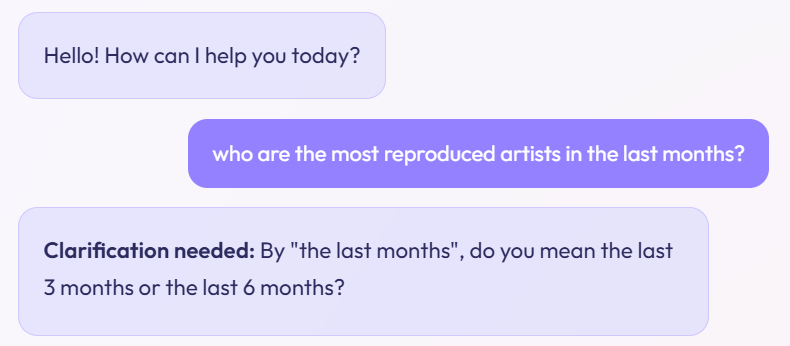
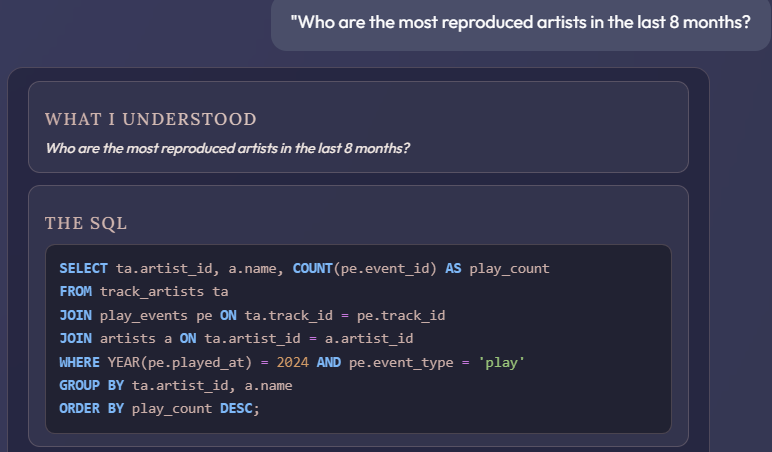
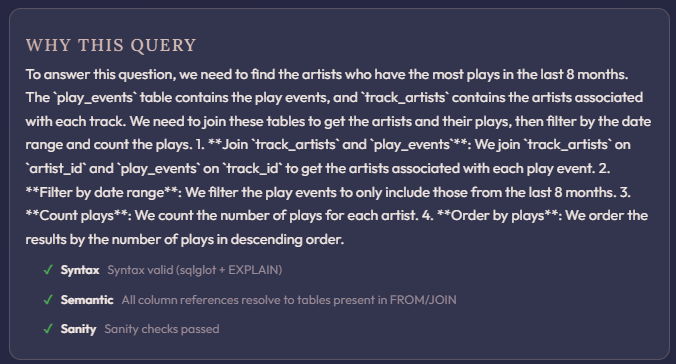
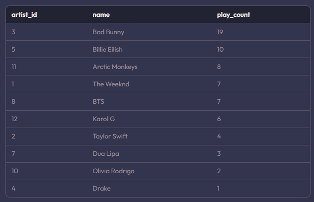
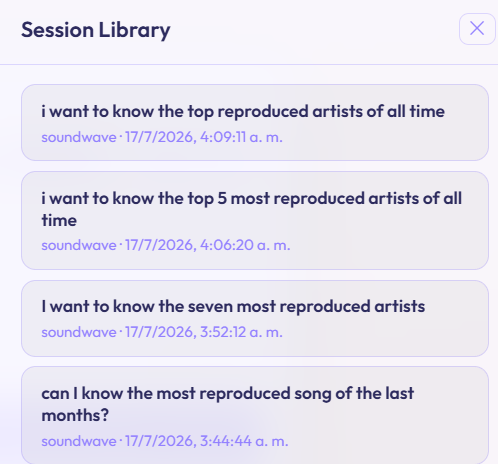
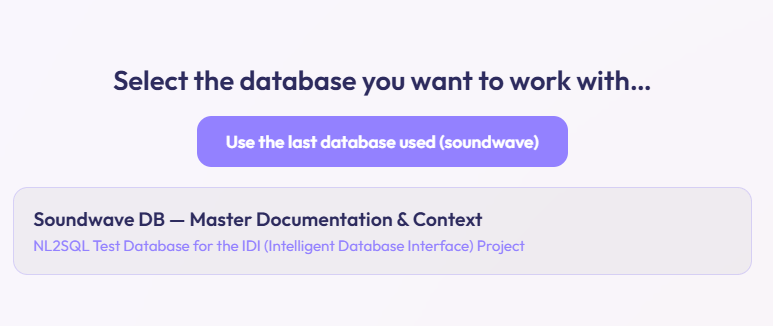
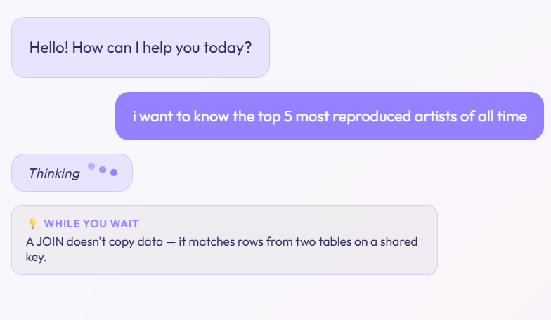

IDI — Interfaz Inteligente de Bases de Datos

Trabajo de Grado — Ingeniería de Sistemas y Computación
Universidad Nacional de Colombia
Autor: Juan David Ramírez Torres (jdramirezt@unal.edu.co)
Período: 2026-1S (Febrero 2 – Mayo 30, 2026)

> **[ESQUELETO / DEMO — v2]** Armazón estructural para el Capítulo 3. La v2 alinea el capítulo con la actualización del Capítulo 1 (propósito didáctico como identidad principal del proyecto; 62 RF con 7 requerimientos didácticos transversales; auto-corrección silenciosa por UC-06), incorpora el trabajo de endurecimiento ya comprometido (salvaguarda de filtrado de consultas, 2026-07-06) y añade una sección de estado del requerimiento didáctico por módulo (3.11). Las secciones `[PENDIENTE]` requieren redacción, capturas de pantalla o evidencia de ejecución que aún no se han producido. El contenido no marcado refleja trabajo ya completado y verificable en el repositorio (fase temprana de implementación, per `CLAUDE.md` e historial de commits).
>
> **[Sincronización — 2026-07-16]** El Capítulo 2 (v3) se sincronizó con `IDI_Segundo_Informe.html`, cuya generación (2026-07-15) produjo cinco capturas reales del sistema en ejecución local (Capturas 2.1–2.5, `figures/shot_2_*.png`) y una sección de Referencias. Esta revisión de este capítulo resuelve, en consecuencia, el `[PENDIENTE]` de captura de pantalla que esas mismas capturas ya satisfacen (§3.1) y hereda la bibliografía de diseño del Capítulo 2 (§ REFERENCIAS). El resto de los `[PENDIENTE]` — mediciones de latencia, evidencia de detección de ambigüedad, entrenamiento LoRA — sigue abierto: son evidencia de ejecución o resultados aún no producidos, no contenido que la sincronización con el Capítulo 2 pueda resolver.
>
> **[Actualización — 2026-07-16 · Fine-tuning LoRA]** Se construyó el pipeline completo de datos y entrenamiento LoRA y se generaron los conjuntos de entrenamiento/evaluación, validados por ejecución. La §3.10 se reescribió a partir de trabajo efectivamente realizado y verificable en el repositorio (`training/build_dataset.py`, `training/soundwave_augmentation.py`, `training/lora_config.py`, `training/colab_train_adapter.ipynb`, `data/synthetic/*.jsonl`), y su rama de integración en tiempo de ejecución (hot-swap de adaptadores GGUF) quedó cableada y cubierta por pruebas offline (§3.8). El entrenamiento de los dos adaptadores **se está ejecutando** sobre ese pipeline; las métricas de precisión de ejecución y la comparación A/B contra los perfiles de instrucción son resultados de evaluación y permanecen ruteados al Capítulo 4 (OE4).
>
> **[Revisión editorial — 2026-07-16]** Pasada de redacción sobre todo el capítulo: se adopta el término "query" en lugar de "sonda"; los casos límite se nombran por su nombre completo ("prueba de ejecución de casos límite N") en lugar de los códigos EC-NN; se simplifica la redacción de las secciones 3.3 y 3.6–3.10; y los pendientes que constituyen evidencia de evaluación — la medición del tiempo de verificación (<2s) y el defecto de restauración de sesiones — se trasladan al Capítulo 4.
>
> **[Cierre de alcance — 2026-07-16]** Se redactaron las conclusiones (§3.14) y recomendaciones (§3.15); la §3.11 se actualizó al estado real de los requerimientos didácticos (completos donde aplican; Verificación y Orquestador son mecanismos internos sin objetivo didáctico); y la conexión a base de datos real (MySQL) quedó descartada del alcance en favor de la simulación por archivos de contexto, con rutas preparadas para versiones posteriores de código abierto (§3.13).

> **[Actualización — 2026-07-21 · Endurecimiento de la verificación]** Se añade la §3.12, que documenta una jornada de endurecimiento sobre el Generador SQL (§3.3) y el Agente de Verificación (§3.4): las tres partes que consultan el vocabulario cerrado de uniones — prompt, planificador y verificador — no coincidían entre sí, y el verificador rechazaba SQL correcto. El hallazgo obliga a matizar una afirmación del capítulo: la cadena de verificación no solo puede fallar dejando pasar SQL incorrecto, sino también rechazando el correcto, y ese segundo error es el más costoso para el propósito didáctico. Se introduce además un tercer veredicto ("posiblemente correcto") para las consultas cuya corrección depende de la interpretación de la pregunta, y se cierra una guarda de solo lectura duplicada que era a la vez demasiado estricta y demasiado laxa. Las secciones siguientes se renumeran (3.12→3.13, 3.13→3.14, 3.14→3.15). La medición del efecto de este trabajo sobre la precisión de las respuestas es evidencia de evaluación y queda ruteada al Capítulo 4 (OE4).

ÍNDICE

Capítulo 3: Desarrollo de la Solución
    3.1. Adquisición de Contexto: Context Manager Agent y FileConnector
    3.2. Comprensión de Consultas, Clarificación y Salvaguarda de Filtrado
    3.3. Generador SQL
    3.4. Agente de Verificación
    3.5. Motor de Visualización
    3.6. Gestor de Sesiones
    3.7. Orquestador Multi-Agente
    3.8. Registro de Instrucciones y Disciplina de Hot-Swap
    3.9. Reconstrucción del Frontend
    3.10. Datos Sintéticos y Fine-Tuning LoRA
    3.11. Estado del Requerimiento Didáctico Transversal por Módulo
    3.12. Endurecimiento de la Verificación: un Solo Vocabulario de Uniones y Veredicto de Tres Estados
    3.13. Estado de Avance y Problemas Conocidos
    3.14. Conclusiones del Capítulo
    3.15. Recomendaciones

────────────────────────────────────────────────────────────────────────

CAPÍTULO 3: DESARROLLO DE LA SOLUCIÓN

Este capítulo desarrolla el tercer objetivo específico (OE3): implementar los siete módulos centrales de IDI con generación de datos sintéticos de entrenamiento, pipelines de fine-tuning, gestión de flujo conversacional y componentes de interfaz de usuario. A diferencia del Capítulo 2 (diseño), este capítulo documenta lo efectivamente construido — código en ejecución, verificado mediante pruebas y demostraciones — y es explícito sobre lo que quedó pendiente o en curso. Bajo el propósito actualizado del Capítulo 1 — IDI como compañero didáctico que responde enseñando —, la implementación de cada módulo se reporta en dos planos: su función central y el estado de su requerimiento didáctico transversal (consolidado en la Sección 3.11). El resultado alimenta el análisis de resultados (OE4, Capítulo 4).

3.1. ADQUISICIÓN DE CONTEXTO: CONTEXT MANAGER AGENT Y FileConnector

Implementado. El agente se alimenta de una base de datos SQLite en memoria construida a partir de archivos fuente por base de datos (`databases/<db_name>/*.sql`), a través de `FileConnector` (generalizado desde `SoundwaveFileConnector`) y `backend/app/services/db/discovery.py`. El glosario de negocio se extrajo del código a un archivo `NN_<db>_survey.json` por base de datos — un aporte directo al propósito didáctico: el contexto que el sistema usa para entender el dominio es el mismo que el aprendiz puede consultar como material de estudio.

La Captura 2.3 del Capítulo 2 (§2.2, drawer "DB Info") documenta el paquete de contexto generado — esquema de SoundWave con columnas, tipos y claves, y el glosario de términos crípticos del dominio con su significado.

3.2. COMPRENSIÓN DE CONSULTAS, CLARIFICACIÓN Y SALVAGUARDA DE FILTRADO

Implementado en la fase temprana de implementación, con perfil de instrucción especializado (`backend/app/prompts/clarification.md`) ajustado contra las pruebas de ejecución de casos límite 1 a 8.

Durante la fase de endurecimiento se añadió una salvaguarda de enrutamiento de consultas (2026-07-06), cuyo diseño se documenta en el Capítulo 2 (§2.5): antes de que una pregunta llegue al parseo de intención y a la generación de SQL, un filtro basado en lista de permitidos (allowlist) determina si la pregunta se relaciona con la base de datos activa (vocabulario del dominio derivado del `DBProfile`) o si constituye una pregunta de conocimiento SQL. Las preguntas sobre el sistema o la base de datos seleccionada se responden por una ruta separada — las respuestas de la base de datos seleccionada —, siempre fundamentada en hechos actuales del `DBProfile`; las preguntas no relevantes para bases de datos quedan fuera del propósito de IDI y reciben una redirección cortés sin invocar el pipeline NL2SQL. La salvaguarda está cubierta por pruebas offline (`tests/test_meta_question_filter.py`, `tests/test_query_understanding.py`).

Captura 3.1 — Ejemplo real del filtro de clarificación: ante la pregunta "who are the most reproduced artists in the last months?", el agente de comprensión de consultas detecta la ambigüedad temporal de "the last months" y pide precisión ("¿los últimos 3 meses o los últimos 6 meses?") antes de generar SQL. Fuente: sistema IDI en ejecución local.

3.3. GENERADOR SQL

Implementado en la fase temprana de implementación. El Generador SQL es el traductor del sistema: recibe la intención estructurada que produce el agente de comprensión de consultas y la convierte en una única consulta SQL de solo lectura. Para hacerlo no trabaja a ciegas: su prompt se construye con la capa de contexto de la base de datos activa — el resumen del esquema (tablas, columnas, tipos y claves), el glosario de términos del dominio y los pasajes de contexto recuperados para la pregunta —, de modo que la traducción queda anclada a la base de datos real y no a suposiciones del modelo. Junto con el SQL, el agente reporta su razonamiento y los supuestos que asumió, insumo directo del panel didáctico de la respuesta. Su salida nunca se ejecuta directamente: pasa primero por el Agente de Verificación (§3.4), y si la verificación la rechaza, el generador recibe el error real del motor y produce una versión corregida (§3.7).

La instrucción especializada del agente fue ajustada en la fase temprana y reforzada durante el endurecimiento (ajustes en `sql_generator.py` y su perfil de instrucción). Ese perfil es, además, la línea base que el adaptador LoRA entrenado para este agente busca superar: el conjunto de entrenamiento sobre-muestra deliberadamente los modos de fallo que el perfil no cerró — los casos límite 2 y 4 —, como se detalla en la §3.10.

Las Capturas 3.2 a 3.4 recorren, sobre una misma pregunta, los paneles con que la respuesta expone el trabajo del Generador SQL: la pregunta tal como el sistema la entendió junto al SQL que produjo, el razonamiento en lenguaje natural seguido del resultado de la cadena de verificación, y las filas devueltas.

Captura 3.2 — Paneles "What I understood" y "The SQL" de la respuesta a la pregunta "Who are the most reproduced artists in the last 8 months?": el agente reformula la pregunta tal como la entendió y muestra la consulta SQL generada, con los JOIN entre `track_artists`, `play_events` y `artists`. Fuente: sistema IDI en ejecución local.

Captura 3.3 — Panel "Why this query": el Generador SQL explica en lenguaje natural el razonamiento de la consulta — qué tablas usa y por qué, y los pasos de unión, filtrado, conteo y ordenamiento — seguido del resultado de la cadena de verificación de tres capas (sintaxis, semántica y sanidad). Fuente: sistema IDI en ejecución local.

Captura 3.4 — Panel "Results": el conjunto de filas devuelto por la consulta, con el identificador y el nombre de cada artista junto a su número de reproducciones. Fuente: sistema IDI en ejecución local.

3.4. AGENTE DE VERIFICACIÓN

Implementado en la fase temprana de implementación como cadena de tres capas (sintaxis → semántica → sanidad). Validado en la Puerta D1 (Gate D1): seis de las ocho queries de prueba pasaron; las dos restantes — las de las pruebas de ejecución de casos límite 7 y 8 — fueron correctamente bloqueadas por la capa de verificación sintáctica, comportamiento fail-safe funcionando según diseño. Un hallazgo de datos de esa fase es relevante para la evaluación (Capítulo 4): la artista referenciada en la query de la prueba de ejecución de casos límite 8 ("Adele") no existe en los datos semilla de SoundWave, por lo que la respuesta correcta de esa query es 0 filas.

La implementación sigue la política de auto-corrección silenciosa fijada en la actualización del Capítulo 1 (UC-06): los fallos que el reintento automático resuelve se consumen como contexto interno y no se exponen al usuario; solo los fallos no corregibles (o los bloqueos de seguridad) llegan a la interfaz, y deben llegar como explicación conceptual, no como error técnico.

La medición real del tiempo de verificación de extremo a extremo frente a su umbral de <2s es evidencia de evaluación y se traslada como pendiente al Capítulo 4 (§4.4).

Una revisión posterior (2026-07-20) mostró que esta cadena también se equivocaba en la dirección contraria a la prevista — rechazando SQL correcto —, y que el vocabulario de uniones que usa para juzgar no coincidía con el que el Generador SQL recibía. La corrección de esos defectos, el tercer veredicto de verificación que introdujo y las salvedades que quedaron abiertas se documentan en la §3.12.

3.5. MOTOR DE VISUALIZACIÓN

Implementado: selección automática de gráfico vía Recharts, integrada en la respuesta didáctica de 4 paneles. La Captura 2.2 del Capítulo 2 (§2.2) muestra el panel de visualización dentro de la respuesta de 4 paneles en el chat en vivo.

[PENDIENTE: inventario de los 8 tipos de gráfico soportados frente a los especificados en el RF del Capítulo 1.]

3.6. GESTOR DE SESIONES

Implementado. El gestor de sesiones guarda las conversaciones para poder retomarlas después: una biblioteca de sesiones (`SessionLibrary`) lista las conversaciones anteriores y permite reabrirlas, y un panel lateral muestra la información de la base de datos con la que se está trabajando. Desde la restructuración multi-base de datos (2026-07-03), cada sesión queda asociada a su base de datos por el nombre de la carpeta que la contiene; el historial guardado hasta ese momento se reinició, y el archivo de sesiones se vuelve a crear vacío, de forma automática, la próxima vez que arranca el backend.

Captura 3.5 — Biblioteca de sesiones (SessionLibrary): lista las conversaciones anteriores, cada una asociada a su base de datos por el nombre de la carpeta ("soundwave") y con su marca de tiempo, y permite reabrirlas. Fuente: sistema IDI en ejecución local.

3.7. ORQUESTADOR MULTI-AGENTE

Implementado. El orquestador dirige el flujo completo de cada consulta: decide qué agente interviene en cada fase y, justo antes de ejecutarlo, activa el perfil de instrucción de ese agente. Cuando un agente arranca, el evento de progreso que se envía al frontend incluye la etiqueta del perfil que quedó activo, de modo que la interfaz puede mostrar en todo momento qué agente está trabajando y con qué especialización — sin que el frontend necesitara cambios, pues ya leía esa etiqueta de los eventos de estado. Esta trazabilidad de fase y agente activo es, además, el requerimiento didáctico del módulo, ya implementado (Sección 3.11).

El orquestador también implementa la recuperación automática ante SQL rechazado, con un máximo de dos intentos. Primero, si la cadena de verificación propone una reparación de la consulta, el orquestador la aplica y la vuelve a verificar. Si aún falla, realiza un único reintento de regeneración: devuelve al Generador SQL el error real reportado por el motor (por ejemplo, una columna que no existe) para que produzca una consulta corregida, que se verifica de nuevo. Ambos intentos siguen la política de auto-corrección silenciosa (Sección 3.4): el usuario no ve el detalle de la recuperación, solo el resultado final; y si tras ambos intentos el SQL sigue sin pasar la verificación, no se ejecuta nunca y el fallo llega a la interfaz como explicación conceptual. La cancelación, por su parte, aprovecha el diseño de streaming de la respuesta: los eventos del pipeline viajan como un flujo continuo hacia el frontend, y si el usuario cancela, la conexión se cierra y el pipeline se detiene en la siguiente frontera entre agentes (objetivo de propagación <500ms, UC-05).

3.8. REGISTRO DE INSTRUCCIONES Y DISCIPLINA DE HOT-SWAP

Implementado. La orquestación de agentes permite cambiar de habilidad sobre la marcha, según el orquestador dictamine para cada fase de la ejecución: cada agente tiene asociada una especialización, y el sistema activa la que corresponde justo antes de que ese agente trabaje. El mapeo de qué especialización usa cada agente vive fuera del código, en un registro (`adapters/registry.json`, gestionado por `backend/app/services/adapter_registry.py`), de modo que cambiar la habilidad de un agente no exige tocar el pipeline. Los cuatro perfiles de instrucción (`backend/app/prompts/*.md`) fueron expandidos a especializaciones reales, ajustadas contra las pruebas de ejecución de casos límite 1 a 8. El servicio LLM expone además `chat_with_meta()` para reportar tokens por segundo, insumo de la evaluación de desempeño (Capítulo 4, §4.4).

El mecanismo acepta dos tipos de especialización por la misma interfaz: perfiles de instrucción (archivos de texto que se anteponen al prompt del agente) y adaptadores LoRA entrenados (archivos GGUF que modifican los pesos del modelo). Con el entrenamiento en marcha (§3.10), la rama de adaptadores quedó cableada (2026-07-16): el registro ya declara adaptadores GGUF para el Generador SQL y el agente de comprensión de consultas, el servidor de inferencia arranca con cada adaptador disponible precargado, y el orquestador enciende el del agente en turno. El diseño es fail-safe: si el archivo de un adaptador no existe, el sistema vuelve de forma transparente al perfil de instrucción del mismo nombre — un adaptador faltante nunca bloquea el pipeline. El comportamiento está cubierto por pruebas offline (`tests/test_adapter_registry.py`).

3.9. RECONSTRUCCIÓN DEL FRONTEND

Implementado. Durante la reconstrucción se pasó de Tailwind a CSS puro para mejorar el mantenimiento y la modularidad de los estilos. La interfaz ofrece respuestas didácticas de 4 paneles, etiquetas del perfil activo de cada agente, autocompletado inline, la biblioteca de sesiones y el panel de información de la base de datos. En la primera vista podemos seleccionar una base de datos, funcionalidad añadida en la restructuración multi-base de datos. La respuesta de 4 paneles es el vehículo principal del propósito didáctico en la interfaz: la misma respuesta que el ejecutivo lee como insight, el aprendiz la lee como lección (qué se entendió, qué SQL se construyó, qué resultado produjo y cómo se visualiza).

Captura 3.6 — Pantalla de selección de base de datos en la primera vista (DatabaseSelector): lista las bases de datos disponibles y ofrece el atajo "usar la última base de datos utilizada" (soundwave), añadida en la restructuración multi-base de datos. Fuente: sistema IDI en ejecución local.

La respuesta didáctica de 4 paneles se documenta en la Captura 2.2 del Capítulo 2 (§2.2).

Captura 3.7 — Frase didáctica de espera ("WHILE YOU WAIT"): mientras el pipeline procesa la consulta, la interfaz muestra el estado "Thinking…" junto a una micro-lección relacionada con la pregunta (aquí, qué hace un JOIN). Fuente: sistema IDI en ejecución local.

3.10. DATOS SINTÉTICOS Y FINE-TUNING LoRA

Esta sección documenta dos desviaciones frente al plan original del Capítulo 1 (§1.10), que especificó el entrenamiento de cuatro adaptadores LoRA vía QLoRA/Unsloth sobre datasets de 15,000–20,000 ejemplos. Ambas responden a decisiones de ingeniería tomadas para acelerar etapas del desarrollo general del proyecto — como lo fue también realizar las pruebas y el primer entrenamiento únicamente sobre SoundWave —: toda la lógica del backend se levantó, y sus pruebas se ejecutan, usando perfiles de instrucción sobre el mismo mecanismo de hot-swap (§3.8), lo que permitió posponer el entrenamiento hasta contar con resultados reales del sistema en operación. El entrenamiento, tal como lo definimos luego, tuvo más sentido según los resultados que hemos tenido del sistema sin entrenar: los datos se concentran en los modos de fallo que el sistema aún no cierra. Las dos desviaciones — número de adaptadores y tamaño del dataset — se justifican a continuación; el entrenamiento **se está llevando a cabo** sobre el pipeline que esta sección documenta.

3.10.1. El corpus fuente y la escasez de datos apropiados para el entrenamiento

Una auditoría del repositorio (2026-07-16) estableció que la única fuente de pares pregunta→SQL verificados a mano para SoundWave es el catálogo de casos límite (`databases/soundwave/03_soundwave_edge_cases.md`): 30 consultas (Q01–Q30), cada una con su SQL correcto, su versión típicamente errónea y el modo de fallo NL2SQL que ejercita (casos límite 1 a 18). Ninguna otra fuente sirve como verdad de referencia: las 8 queries de `gate_d1.py` no traen SQL objetivo, `tests/evaluate.py` valida conjuntos de resultados (no SQL), y los turnos registrados en `data/sessions.db` son salida no verificada del propio modelo. Treinta ejemplos con tres épocas producirían memorización, no aprendizaje; el pipeline de datos existe precisamente para convertir esas 30 semillas en un conjunto de entrenamiento de precisión sin diluir su calidad.

3.10.2. Construcción del dataset (`training/build_dataset.py`)

El generador produce cuatro archivos JSONL en `data/synthetic/` — train/eval para el SQL Generator (334 ejemplos) y para el Query Understanding (349 ejemplos) — bajo cuatro principios verificables:

- **Fidelidad de prompt:** el entrenamiento se lleva a cabo teniendo en cuenta que IDI cuenta con una capa de contexto por base de datos: cada ejemplo de entrenamiento incluye la misma información de contexto que el agente recibe cuando opera — el resumen del esquema, el glosario de términos del dominio y los pasajes recuperados para la pregunta —, de modo que el adaptador aprende en las mismas condiciones en las que luego trabaja. Esta decisión es la que hace coherente el fine-tuning con la arquitectura orientada al contexto por base de datos descrita en el Capítulo 2.

- **Validación por ejecución:** todo el SQL del dataset es válido, porque se comprobó ejecutándolo: cada consulta se corre contra la base de datos y, si falla o no devuelve el resultado esperado, se descarta. Un dataset NL2SQL sin esta garantía arrastra SQL sintácticamente válido pero semánticamente incorrecto — exactamente el modo de fallo que IDI combate.

- **Aumentación dirigida a las brechas:** sobre cada semilla se generan paráfrasis y sustituciones de valores (otros países, géneros, planes) tomadas del propio `02_soundwave_data.sql`. La aumentación sobre-muestrea deliberadamente los dos modos de fallo donde el prompt engineering tocó techo (Capítulo 2, §2.9): el caso límite 2 — término de negocio hacia columna booleana o codificada, p. ej. "audio de alta fidelidad" → `has_hifi = 1` — y el caso límite 4 — dirección del auto-join, p. ej. `genres.parent_genre_id` —, con decenas de ejemplos por familia en ambos sentidos del auto-join.

- **Separación entre entrenamiento y evaluación:** el modelo nunca ve durante el entrenamiento las preguntas con las que después será evaluado: las 30 preguntas originales y las 8 queries de prueba se reservan exclusivamente para la evaluación, y el entrenamiento usa solo versiones reformuladas de ellas (paráfrasis y cambios de valores); no hay ninguna pregunta repetida entre ambos conjuntos. Es la misma lógica de un examen justo: se estudia con ejercicios parecidos, pero las preguntas del examen no se conocen de antemano. Gracias a esto, la evaluación del Capítulo 4 mide si el modelo aprendió a traducir, no si memorizó respuestas.

3.10.3. La receta de entrenamiento (`training/lora_config.py`, `training/colab_train_adapter.ipynb`)

El entrenamiento se ejecuta en Google Colab (GPU T4) con Unsloth sobre `Qwen2.5-Coder-3B-Instruct` en cuantización de 4 bits (QLoRA), replicando los hiperparámetros del Capítulo 1: rango r = 16, α = 32, dropout 0.05, módulos objetivo de atención y MLP, 3 épocas, tasa de aprendizaje 2e-4. Un detalle metodológico crítico: la pérdida se computa **solo sobre la respuesta del asistente** (`train_on_responses_only`), nunca sobre el prompt cargado de esquema — de otro modo el adaptador aprendería a regenerar el esquema en lugar de la habilidad de traducir. Cada adaptador se exporta a formato GGUF (`convert_lora_to_gguf.py`) para ser servido por llama.cpp junto al modelo base Q4_K_M, dentro del presupuesto de restricción dura de < 3.5 GB de VRAM (Capítulo 1).

3.10.4. Decisión de alcance: dos adaptadores, calidad sobre cantidad

Se entrenan dos adaptadores — SQL Generator y Query Understanding —, no los cuatro del plan. La razón es honesta: los agentes de Verificación y Clarificación no cuentan con un solo ejemplo etiquetado, y entrenarlos sería fabricar datos; además, la evidencia de los benchmarks sitúa las brechas más importantes en la generación de SQL y en su comprensión previa.

El entrenamiento también se preparó de manera óptima para casos generales de SQL, no solo para SoundWave. Una parte del conjunto del Generador SQL (~350 ejemplos filtrados de `gretelai/synthetic_text_to_sql`) proviene de bases de datos distintas, y cada uno de esos ejemplos lleva en su bloque de contexto el esquema de su propia base. Con esto el adaptador no puede limitarse a memorizar SoundWave: se ve obligado a aprender la habilidad general de leer el esquema que se le entrega y traducir sobre él — la misma habilidad que necesitará frente a cualquier base de datos nueva que se agregue al sistema. El agente de comprensión de consultas permanece centrado en SoundWave, pues su salida (el intent estructurado) no tiene equivalente externo directo.

El tamaño resultante — cientos, no decenas de miles, de ejemplos — es una consecuencia deliberada de anteponer la precisión verificada por ejecución a la escala: para un modelo de 3B sobre hardware de consumo y un objetivo estrecho (los casos límite 2 y 4), un conjunto pequeño y correcto supera a uno grande y ruidoso.

3.10.5. Integración en tiempo de ejecución

El seam de hot-swap quedó cerrado en su rama GGUF (§3.8): `adapters/registry.json` declara `kind: "gguf"` para los dos agentes entrenados; `start.py` arranca llama.cpp con un flag `--lora` por cada adaptador presente (`--lora-init-without-apply`, escala 0 al inicio); y el orquestador activa el adaptador del agente en turno fijando su escala a 1.0 vía `POST /lora-adapters` (`llm_service.load_gguf_adapter`). Mientras un adaptador GGUF está activo, el perfil de instrucción `.md` **no** se antepone — el conocimiento quedó destilado en los pesos, y el adaptador se entrenó sobre el `SYSTEM_PROMPT` desnudo del agente —. La ausencia de un archivo GGUF revierte de forma segura al perfil de instrucción, de modo que el sistema nunca se bloquea por un adaptador faltante.

3.11. ESTADO DEL REQUERIMIENTO DIDÁCTICO TRANSVERSAL POR MÓDULO

El Capítulo 1 (§1.6) asignó un requerimiento didáctico a cada uno de los siete módulos. Durante la implementación, dos de ellos (Verificación y Orquestador) se reclasificaron: son mecanismos internos del sistema, sin un objetivo didáctico de cara al usuario. El estado de los demás, insumo de la evaluación de Claridad Didáctica del Capítulo 4 (§4.7), es el siguiente:

| Módulo | Requerimiento didáctico (Capítulo 1, §1.6) | Estado |
|---|---|---|
| Context Manager | Mini-glosario navegable del dominio, con ejemplos por término | Completo — ya existe y se encuentra correctamente integrado (panel de información de la base de datos, con esquema y glosario) |
| Query Understanding | Cada clarificación explica por qué la ambigüedad importa | Completo — el sistema ya incorpora estas desambiguaciones y aclaraciones dentro de su funcionamiento |
| SQL Generator | Anotación por cláusula del SQL generado | Completo — cada respuesta explica por qué se usaron esas tablas y esas columnas |
| Verification | Explicación conceptual de los fallos que llegan al usuario | No aplica — es un mecanismo interno del sistema; no es relevante enseñar al usuario por qué falló un intento, y los fallos corregibles se resuelven en silencio (UC-06) |
| Visualization Engine | Justificación de la elección del tipo de gráfico | Implementación básica, para casos muy generales |
| Session Manager | Sesiones marcables como "ruta de aprendizaje" exportable | Cumplido — las sesiones permiten al usuario repasar sus preguntas y su aprendizaje |
| Orchestrator | Trazabilidad de fase y agente activo | No aplica como objetivo didáctico — es solo el orquestador; su trazabilidad de fase y agente activo está implementada y visible en la interfaz |

3.12. ENDURECIMIENTO DE LA VERIFICACIÓN: UN SOLO VOCABULARIO DE UNIONES Y VEREDICTO DE TRES ESTADOS

Esta sección documenta una jornada de endurecimiento realizada el 2026-07-20 sobre el Generador SQL (§3.3) y el Agente de Verificación (§3.4). No añade módulos ni cambia la arquitectura: corrige la forma en que tres partes del sistema ya construido se comunicaban entre sí, y añade un tercer veredicto de verificación. Se documenta aquí porque el hallazgo central contradice un supuesto que el capítulo daba por sentado — que la cadena de verificación solo podía equivocarse dejando pasar SQL malo.

3.12.1. El problema: tres partes con tres respuestas distintas

El sistema define un "vocabulario cerrado de uniones": el conjunto de igualdades `tabla.columna = tabla.columna` que son uniones legales, derivado de las claves foráneas del esquema. Tres partes lo consultan y deben coincidir: el prompt que se le entrega al modelo (que enumera las uniones permitidas), el planificador que calcula la ruta entre tablas, y el verificador que revisa el SQL producido. Al reproducir su comportamiento sobre la base de datos SoundWave en ejecución, las tres discrepaban.

El caso más costoso estaba en el prompt. El planificador entrega rutas que incluyen atajos transitivos — uniones que no son una clave foránea literal, pero que son igual de válidas porque ambas columnas apuntan a la misma clave. De las 75 igualdades legales del esquema, solo 29 son claves foráneas directas. El prompt, sin embargo, enumeraba únicamente esas 29 y afirmaba que "una clave de unión no listada aquí no existe", mientras el plan adjunto en el mismo mensaje ordenaba "copia estas cláusulas literalmente" para una unión ausente de la lista. El modelo recibía dos instrucciones contradictorias en el mismo mensaje, y precisamente sobre la consulta más frecuente del proyecto (la de la prueba de ejecución de casos límite 8).

Un segundo defecto afectaba al planificador. Las claves foráneas que una tabla dirige hacia sí misma — el género padre de un género, el usuario que refirió a otro usuario, la lista de reproducción de la que otra se bifurcó — se estaban tratando como si fueran identidades. El efecto era que 11 de las 86 uniones que el sistema consideraba legales eran falsas, y una de ellas llegaba a los planes: al conectar listas de reproducción con canciones, el sistema proponía unir por la columna de bifurcación en lugar de por el identificador de la lista. La consulta se ejecutaba, devolvía casi nada, y la verificación la aprobaba, porque el verificador consultaba el mismo vocabulario contaminado.

3.12.2. El hallazgo principal: la verificación también se equivocaba rechazando

El supuesto implícito del diseño era que el verificador es una red de seguridad: su error posible es dejar pasar SQL incorrecto. La revisión mostró que también rechazaba SQL correcto, y que ese error es el más caro de los dos.

Se reprodujeron cinco rechazos indebidos, todos con SQL válido y ejecutable:

| SQL correcto rechazado | Causa |
|---|---|
| Consultas con cláusula `WITH` (expresiones de tabla común) | El nombre que la propia consulta define se buscaba en el esquema y se reportaba como "tabla alucinada" |
| `ON al.artist_id = a.artist_id AND al.label = a.label` | Se exigía que *toda* igualdad del `ON` fuera una clave foránea; un filtro acompañando a la clave se leía como unión inventada |
| `WHERE ... HAVING COUNT(*) > 5` escrito en una sola línea | La revisión usaba una expresión regular cuyo punto no cruza saltos de línea: el veredicto dependía de dónde el modelo hubiera partido las líneas |
| Consultas con `WITH` (segunda causa, independiente) | La guarda de solo lectura exigía que el texto empezara por `SELECT`, y estas empiezan por `WITH` |
| `WHERE x IN (SELECT ... HAVING COUNT(*) > 5)` | Detectado durante el arreglo del tercer caso: la primera corrección propuesta habría introducido este nuevo falso positivo |

Por qué importa para el propósito didáctico del sistema: un rechazo indebido no tiene mensaje de corrección posible, porque el modelo no hizo nada mal. El ciclo de regeneración gasta un intento completo, vuelve a fallar igual, y el usuario recibe una respuesta equivocada acompañada de una explicación segura de sí misma — el peor resultado para una herramienta cuyo propósito es enseñar. La regla operativa que se adoptó es que el verificador solo puede exigir reglas que el prompt efectivamente enuncia; si una comprobación no corresponde a ninguna regla enunciada, o se añade la regla al prompt, o se retira la comprobación.

También se cerró un problema de seguridad que la revisión destapó: la guarda de solo lectura estaba escrita dos veces (en el verificador y en el conector), y ambas copias fallaban en las dos direcciones. Rechazaban toda consulta con `WITH`, y a la vez dejaban pasar `SELECT 1; DROP TABLE users`, porque el texto empieza por `SELECT`. Ahora existe una sola definición compartida, basada en el árbol sintáctico y que falla del lado seguro; es estrictamente más estricta que la anterior.

3.12.3. El tercer veredicto: "posiblemente correcto"

Algunas consultas no son correctas ni incorrectas hasta saber qué quiso decir quien pregunta. "Qué canciones tiene la lista X" y "qué canciones se reprodujeron desde la lista X" producen SQL distinto, ambos legales, y el grafo de claves foráneas no puede distinguirlos: ve dos rutas igual de cortas y elige una por orden alfabético. Lo mismo ocurre con la dirección de una unión de una tabla consigo misma (padre o hijo) y con cualquier unión cuyo extremo no sea una tabla del esquema.

Aprobarlas en silencio afirma una certeza que el sistema no tiene; rechazarlas descarta SQL correcto. Por eso el veredicto de verificación pasó de dos estados a tres: aprobado, **posiblemente correcto** y rechazado. "Posiblemente correcto" no bloquea nada — la consulta se ejecuta igual — pero adjunta a la respuesta la lectura que se asumió y la alternativa que existía, con lo que la ambigüedad se convierte en material didáctico en lugar de en un error invisible. Cuatro situaciones lo activan: ruta de unión ambigua, unión de una tabla consigo misma, extremo de unión no verificable, e igualdad adicional entre dos columnas clave que ninguna clave foránea relaciona.

Para los casos en que el dominio sí tiene una respuesta correcta, la encuesta de cada base de datos admite ahora declararla (`join_preferences`): una entrada fija la ruta canónica y silencia la advertencia para ese par de tablas. Se declaró una sola, la que la documentación de casos límite ya establecía; el resto de los empates permanece marcado como ambiguo, que es la postura honesta por defecto.

3.12.4. Fidelidad de las pruebas

Las pruebas construían el perfil de la base de datos solo por introspección, mientras el sistema en ejecución lo construye por introspección más la encuesta de dominio. El glosario, los mapas de valores codificados y las preferencias de unión llegaban vacíos a las pruebas. No era un defecto del sistema en ejecución — que siempre aplicó la encuesta —, sino de las pruebas, que ejercitaban un perfil que la aplicación nunca usa: una función guiada por la encuesta podía verse rota en pruebas y sana en la aplicación, o al revés. Las pruebas ahora replican el perfil de producción. En esa verificación se detectó además que las entradas de comentario de los archivos de encuesta (`_comment`, usadas porque JSON no admite comentarios) llegaban al perfil como conocimiento de dominio real y se habrían entregado al modelo dentro del glosario; ahora se descartan al cargar.

3.12.5. Resultado

La suite de pruebas pasó de 104 a 208 pruebas en verde. Las nuevas se agrupan en tres archivos con propósitos distintos: las que fijan que el planificador nunca proponga una unión que su propio verificador rechazaría; un corpus de SQL legal que debe pasar la verificación completa **y ejecutarse de verdad**, que es la salvaguarda contra volver a introducir rechazos indebidos; y las del tercer veredicto, que comprueban sobre todo que una advertencia jamás bloquee la ejecución. El corpus es la pieza que más valor demostró: encontró por sí solo dos de los defectos anteriores, incluido el de la guarda de solo lectura, que estaba oculto detrás de otro y solo apareció cuando el primero quedó corregido.

3.12.6. Problemas conocidos y salvedades

Los siguientes puntos quedan **abiertos y documentados como tales**; ninguno bloquea el funcionamiento del sistema.

| Problema conocido / salvedad | Estado y razón |
|---|---|
| Ruta de unión ambigua entre tablas puente | **Conocido, no resoluble por esquema.** Cuando dos rutas son igual de cortas, la respuesta correcta depende de la pregunta, no de la base de datos. Se marca como "posiblemente correcto" y se declara la ruta canónica en la encuesta cuando el dominio la tiene |
| Dirección de una unión de tabla consigo misma | **Conocido, no verificable.** El grafo conoce tablas, no roles: no puede distinguir padre de hijo. Se marca como "posiblemente correcto" |
| Uniones con un extremo que no es tabla del esquema | **Conocido, no verificable.** Una expresión `WITH`, una subconsulta o un alias de un ámbito superior no tienen clave foránea contra la cual comprobar. Se marca como "posiblemente correcto" |
| Clave inventada acompañando a una clave foránea real | **Salvedad aceptada.** Se exige que la unión esté anclada en al menos una relación real; una igualdad adicional errónea solo puede reducir filas, nunca inventar una relación. Se marca como "posiblemente correcto" en lugar de rechazarse, para no reintroducir el falso positivo del filtro dentro del `ON` |
| Uniones implícitas por coma (`FROM a, b WHERE ...`) | **Cerrado por rechazo explícito.** Eludían por completo la revisión de claves de unión. Se rechazan con un mensaje que indica reescribir con `JOIN ... ON`, que es lo que el prompt ya exigía |
| Medición del efecto sobre la precisión de las respuestas | **Trasladado al Capítulo 4.** Este trabajo corrige un defecto estructural; cuantificar su efecto es evidencia de evaluación (OE4) |

3.13. ESTADO DE AVANCE Y PROBLEMAS CONOCIDOS

| Artefacto | Estado |
|---|---|
| Pipeline de 7 agentes end-to-end sobre `/query` | Completado (fase temprana de implementación) |
| Frontend didáctico de 4 paneles | Completado (fase temprana de implementación) |
| Registro de adaptadores/instrucciones + hot-swap | Completado (fase temprana de implementación) |
| Suite de pruebas offline (`pytest`) | Completado (fase temprana de implementación), extendida con las pruebas de filtrado de consultas y con las de vocabulario de uniones y falsos positivos de verificación (208 pruebas, 2026-07-20 — §3.12) |
| Endurecimiento del vocabulario de uniones y falsos positivos de verificación | Completado (2026-07-20) — con salvedades documentadas en la §3.12.6 |
| `ruff`/`black`, `eslint`/`prettier` | Completado (fase temprana de implementación) |
| Salvaguarda de filtrado de consultas (allowlist) | Completado (2026-07-06) |
| Documentación visual del frontend (capturas del sistema en ejecución) | Completado — hay capturas a lo largo de este capítulo y del Capítulo 2 |
| Requerimientos didácticos transversales (7) | Completado donde aplica — ver Sección 3.11 |
| Conexión a base de datos real (MySQL) | Descartada del alcance — las bases de datos se simulan desde sus archivos de contexto (ver nota al final de esta sección) |
| Pipeline de datos sintéticos + datasets LoRA (train/eval, validados por ejecución) | Completado (2026-07-16) |
| Cableado de hot-swap de adaptadores GGUF (rama `kind: gguf`) | Completado (2026-07-16), con pruebas offline |
| Entrenamiento LoRA (2 adaptadores: SQL Generator, Query Understanding) | **En ejecución (Colab); métricas A/B → Capítulo 4** |

Nota sobre la conexión a bases de datos reales: la conexión directa a un motor MySQL se descartó del alcance del proyecto, y en su lugar las bases de datos se simulan por medio de sus archivos de contexto (`databases/<db>/`). Implementar la conexión real habría implicado una complejidad mucho mayor del proyecto — credenciales, seguridad, latencias y esquemas fuera de nuestro control — sin aportar a los objetivos específicos, pues la simulación reproduce fielmente el comportamiento de consulta. La decisión, sin embargo, dejó rutas preparadas para que esa conexión ocurra sin mayor problema más adelante: los agentes consumen una interfaz de conector genérica, de la cual el conector de archivos es la implementación actual, de modo que un conector MySQL puede añadirse sin tocar el pipeline. El autor planea continuar el proyecto por su cuenta como código abierto, y esta es una de las primeras extensiones previstas para versiones posteriores.

3.14. CONCLUSIONES DEL CAPÍTULO

1. (aporta a OE3) Los siete módulos centrales de IDI quedaron implementados y operando de extremo a extremo. Las decisiones de diseño tomadas en el Capítulo 2 — la cadena de verificación de tres capas, la capa de contexto por base de datos, el mecanismo de hot-swap de especializaciones y la respuesta didáctica de 4 paneles — se implementaron satisfactoriamente y fueron las que permitieron que el proyecto funcionara: cada una está validada en el sistema en ejecución (Puerta D1, suite de pruebas offline y las capturas de este capítulo y del Capítulo 2).

2. (aporta a OE3) Completar el desarrollo exigió tomar decisiones ingenieriles que se desvían del plan original, y tomarlas fue lo correcto: invertir el orden de los sprints (agentes primero, base de datos física al final), levantar el backend sobre perfiles de instrucción antes de entrenar, realizar las pruebas y el primer entrenamiento únicamente sobre SoundWave, y descartar la conexión MySQL real en favor de la simulación por archivos de contexto. Desviarse del plan es parte normal de un proceso de desarrollo cuando la evidencia lo respalda; lo importante es que cada desviación quedó documentada con su justificación.

3. Ser honestos frente al alcance del proyecto — y muy selectivos sobre qué implementar y qué no — resultó tan valioso como la implementación misma. El ejemplo central es el fine-tuning: se entrenaron solo los dos adaptadores LoRA más relevantes según lo investigado (el Generador SQL y la comprensión de consultas), con cientos de ejemplos verificados por ejecución en lugar de decenas de miles sin verificar, anteponiendo la calidad demostrable a la escala aparente.

4. El requerimiento didáctico transversal se implementó sin módulos adicionales: donde aplica, viaja dentro de los contratos existentes (respuesta de 4 paneles, etiquetas de perfil activo, sesiones repasables, panel de información de la base de datos), lo que valida la decisión de diseño del Capítulo 2 (§2.2).

3.15. RECOMENDACIONES

1. (OE3) Tratar las desviaciones del plan como decisiones de ingeniería de primera clase: registrarlas con su evidencia y su justificación en el momento en que se toman — como se hizo con el número de adaptadores, el tamaño del dataset y la conexión a bases de datos reales —, de modo que la evaluación (OE4) mida el sistema que efectivamente se decidió construir, y no un plan que la evidencia recomendó ajustar.

2. (OE3) Mantener esa misma selectividad de alcance en la fase de evaluación: congelar el protocolo antes de medir, evaluar sobre lo efectivamente implementado y reportar de forma explícita lo que se descartó y por qué.

3. Para versiones posteriores del proyecto — que el autor planea continuar como código abierto —: retomar la conexión a bases de datos reales por las rutas ya preparadas en el diseño (la interfaz de conector genérica) y ampliar el motor de visualización más allá de su implementación básica actual.

────────────────────────────────────────────────────────────────────────

REFERENCIAS

Se heredan del Capítulo 2 las cuatro fuentes de diseño que este capítulo también usa — entrenamiento LoRA (§3.10), cadena de verificación y auto-corrección (§3.4):

Hu, E. J., Shen, Y., Wallis, P., Allen-Zhu, Z., Li, Y., Wang, S., Wang, L., y Chen, W. (2022). LoRA: Low-rank adaptation of large language models. En *Proceedings of the International Conference on Learning Representations (ICLR)*.

Liu, X., Shen, S., Li, B., Ma, P., Jiang, R., Zhang, Y., Fan, J., Li, G., Tang, N., y Luo, Y. (2025a). NL2SQL-BUGs: A benchmark for detecting semantic errors in NL2SQL translation. En *Proceedings of the 31st ACM SIGKDD Conference on Knowledge Discovery and Data Mining (KDD)*. arXiv:2503.11984.

Liu, X., Shen, S., Li, B., Tang, N., y Luo, Y. (2025b). A survey of NL2SQL with large language models: Where are we, and where are we going? *IEEE Transactions on Knowledge and Data Engineering*. arXiv:2408.05109.

Pourreza, M., y Rafiei, D. (2023). DIN-SQL: Decomposed in-context learning of text-to-SQL with self-correction. En *Advances in Neural Information Processing Systems (NeurIPS)*, 36.

Fuentes específicas de este capítulo, correspondientes al modelo base y las fuentes de datos del fine-tuning (§3.10):

Hui, B., Yang, J., Cui, Z., et al. (2024). Qwen2.5-Coder technical report. *arXiv preprint* arXiv:2409.12186.

Gretel.ai (2024). Synthetic Text-to-SQL [conjunto de datos]. Hugging Face. Identificador: `gretelai/synthetic_text_to_sql`.

[PENDIENTE: extender con fuentes de la evaluación de datasets sintéticos y del harness A/B cuando se redacten sus resultados en el Capítulo 4.]

────────────────────────────────────────────────────────────────────────

Universidad Nacional de Colombia — Facultad de Ingeniería — Departamento de Sistemas e Industrial
Período 2026-1S
